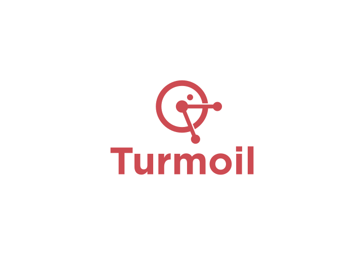

  

<em>Add hardship to your tests.</em>

Turmoil is a family of crates for deterministic simulation testing of
distributed systems. It runs multiple concurrent hosts within a single thread
and injects "hardship" — latency, drops, partitions, crashes, torn writes —
into the simulated network and filesystem, under manual control or a seeded
RNG.

[![Build Status][actions-badge]][actions-url]
[![Discord chat][discord-badge]][discord-url]

[actions-badge]: https://github.com/tokio-rs/turmoil/actions/workflows/rust.yml/badge.svg?branch=main
[actions-url]: https://github.com/tokio-rs/turmoil/actions?query=workflow%3ACI+branch%3Amain
[discord-badge]: https://img.shields.io/discord/500028886025895936.svg?logo=discord&style=flat-square
[discord-url]: https://discord.com/channels/500028886025895936/628283075398467594

## Crates

| Crate | Description | |
|---|---|---|
| [`turmoil`](crates/turmoil) | Full simulation-testing framework. Start here. | [![Crates.io][turmoil-crates-badge]][turmoil-crates-url] [![Documentation][turmoil-docs-badge]][turmoil-docs-url] |
| [`turmoil-net`](crates/turmoil-net) | Deterministic simulated socket stack. Drop-in replacement for `tokio::net`. | [![Crates.io][turmoil-net-crates-badge]][turmoil-net-crates-url] [![Documentation][turmoil-net-docs-badge]][turmoil-net-docs-url] |
| [`turmoil-fs`](crates/turmoil-fs) | Deterministic simulated filesystem (scaffold — lift in progress). | _unpublished_ |

[turmoil-crates-badge]: https://img.shields.io/crates/v/turmoil.svg
[turmoil-crates-url]: https://crates.io/crates/turmoil
[turmoil-docs-badge]: https://docs.rs/turmoil/badge.svg
[turmoil-docs-url]: https://docs.rs/turmoil
[turmoil-net-crates-badge]: https://img.shields.io/crates/v/turmoil-net.svg
[turmoil-net-crates-url]: https://crates.io/crates/turmoil-net
[turmoil-net-docs-badge]: https://docs.rs/turmoil-net/badge.svg
[turmoil-net-docs-url]: https://docs.rs/turmoil-net

## Examples

See [`examples/`](examples) for end-to-end samples, and each crate's `tests/`
directory for smaller, feature-focused tests.

## License

This project is licensed under the [MIT license](LICENSE).

### Contribution

Unless you explicitly state otherwise, any contribution intentionally
submitted for inclusion in `turmoil` by you, shall be licensed as MIT,
without any additional terms or conditions.
